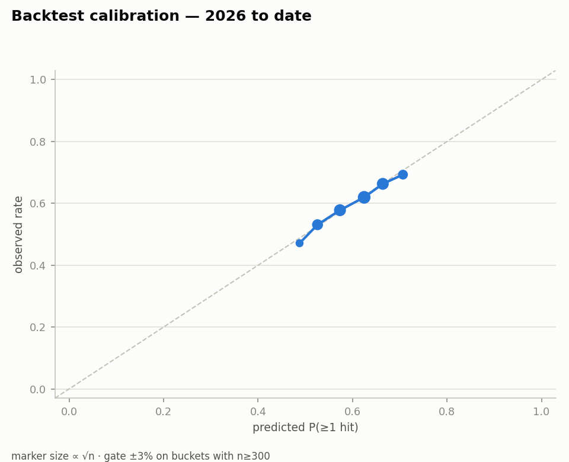
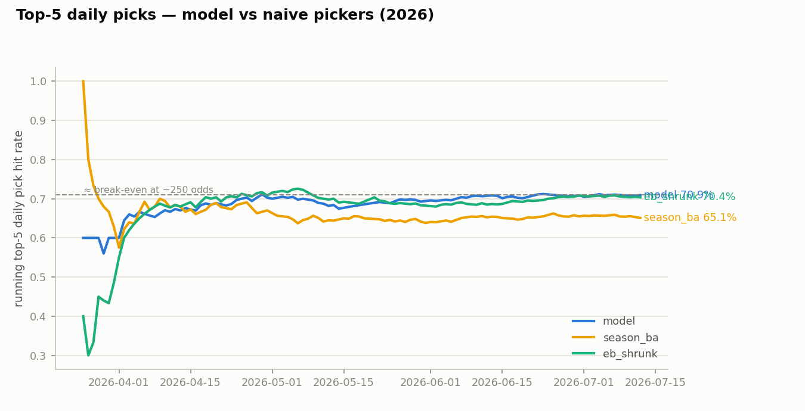

# Backtest report — TEST 2026 to date (Phase 5)

25,960 starter batter-games, 2026-03-25 → 2026-07-12. Base rate 0.607.
Model: `mlb_hits_hit_model@production`. **TEST evaluation #2** — every re-run spends the snooping budget.

Overall: log loss 0.6647 (EB baseline 0.6686), Brier 0.2356 (EB 0.2378).

## 1. Calibration buckets

| bucket | n | pred | obs | gap |
|---|---|---|---|---|
| 0.00 | 1 | 0.0000 | 1.0000 | 1.0000 |
| 0.35 | 1 | 0.3750 | 1.0000 | 0.6250 |
| 0.40 | 217 | 0.4106 | 0.5300 | 0.1194 |
| 0.45 | 913 | 0.4878 | 0.4710 | -0.0168 |
| 0.50 | 3841 | 0.5258 | 0.5309 | 0.0051 |
| 0.55 | 5645 | 0.5733 | 0.5779 | 0.0046 |
| 0.60 | 7377 | 0.6245 | 0.6194 | -0.0052 |
| 0.65 | 5541 | 0.6640 | 0.6631 | -0.0009 |
| 0.70 | 2363 | 0.7067 | 0.6928 | -0.0139 |
| 0.75 | 58 | 0.7561 | 0.6897 | -0.0664 |
| 0.85 | 2 | 0.8750 | 1.0000 | 0.1250 |
| 0.95 | 1 | 1.0000 | 0.0000 | -1.0000 |

## 2. Top-K daily picks

| k | picker | picks | hit_rate | worst_miss_streak |
|---|---|---|---|---|
| 5 | model | 550 | 0.7091 | 4 |
| 5 | season_ba | 550 | 0.6509 | 6 |
| 5 | eb_shrunk | 550 | 0.7036 | 7 |
| 10 | model | 1100 | 0.6973 | 5 |
| 10 | season_ba | 1100 | 0.6627 | 5 |
| 10 | eb_shrunk | 1100 | 0.7064 | 5 |

(season-BA picker requires 50+ season PA before ranking a player)

## 4. Slices

| dimension | level | n | base_rate | mean_pred | cal_gap | log_loss |
|---|---|---|---|---|---|---|
| month | 3 | 1368 | 0.5914 | 0.6031 | -0.0117 | 0.6758 |
| month | 4 | 7033 | 0.6107 | 0.6062 | 0.0045 | 0.6628 |
| month | 5 | 7539 | 0.5933 | 0.6092 | -0.0159 | 0.6706 |
| month | 6 | 7089 | 0.6204 | 0.6107 | 0.0097 | 0.6573 |
| month | 7 | 2931 | 0.6124 | 0.6084 | 0.0040 | 0.6666 |
| quality | Q1 weakest | 6490 | 0.5621 | 0.5521 | 0.0100 | 0.6803 |
| quality | Q2 | 6490 | 0.5935 | 0.5943 | -0.0007 | 0.6731 |
| quality | Q3 | 6490 | 0.6237 | 0.6228 | 0.0009 | 0.6596 |
| quality | Q4 strongest | 6490 | 0.6505 | 0.6643 | -0.0138 | 0.6458 |
| is_home | 0.0 | 12982 | 0.6121 | 0.6132 | -0.0012 | 0.6631 |
| is_home | 1.0 | 12978 | 0.6029 | 0.6035 | -0.0006 | 0.6663 |

## Gates

**PASS** — calibration within ±3 pts on all gated buckets; model top-5 beats the season-BA picker.
